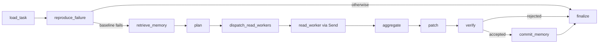

# BoundaryRepro v0.5.2

BoundaryRepro is a stateful repository issue repair agent built with LangGraph.
It accepts a constrained public task, reproduces the failure in a disposable
workspace, investigates the repository with generic tools, applies one bounded
source edit, and accepts the solution only after behavioral verification.

## 1. What the project is

The project demonstrates the engineering boundaries needed around a coding
agent:

- strict task and model-output schemas;
- concurrent read-only investigation with serialized writes;
- resumable SQLite checkpoints;
- provider and long-term-memory isolation;
- behavior-based verification before completion or memory writes;
- auditable tool, provider, and verifier traces.

The primary and only installed command is `boundary-repair`.

## 2. Eleven-node LangGraph



The compiled graph contains exactly these 11 nodes:

1. `load_task`
2. `reproduce_failure`
3. `retrieve_memory`
4. `plan`
5. `dispatch_read_workers`
6. `read_worker`
7. `aggregate`
8. `patch`
9. `verify`
10. `commit_memory`
11. `finalize`

Provider failure, an invalid patch, a passing baseline, verification failure,
or deadline exhaustion routes to a non-completed terminal state.

## 3. TaskSpec and repository tools

A task is a strict JSON object with no answer-bearing fields:

```json
{
  "task_id": "public-task-id",
  "issue_text": "Public issue report and expected behavior.",
  "repository": "repository",
  "test_command": ["{python}", "-m", "unittest", "tests.test_public", "-v"],
  "regression_command": ["{python}", "-m", "unittest", "discover", "-s", "tests", "-v"],
  "editable_paths": ["src/package"],
  "timeout": 30
}
```

The generic tool contract contains:

- `read_issue`
- `list_files`
- `search_code`
- `read_file`
- `run_tests`
- `apply_patch`
- `show_diff`
- `submit_solution`

There is no arbitrary shell tool and no task-specific tool. File access is
rooted in a copied workspace. A patch must be one exact replacement inside an
allowlisted source path; tests, traversal paths, symlinks, dependency
directories, and `.git` are not editable.

## 4. Send concurrency and workspace serialization

`dispatch_read_workers` creates independent `read_worker` branches with
LangGraph `Send`. Evidence and trace lists use append reducers, while a shared
`asyncio.Semaphore` enforces the configured read concurrency.

Every workspace mutation and test command acquires the same workspace lock.
`apply_patch`, public tests, regression tests, and verifier-only tests therefore
cannot race one another, even if callers schedule them concurrently.

## 5. Checkpoints, pause/resume, and memory

Runtime state is stored under `.boundary_state/`:

```text
.boundary_state/
  repair-checkpoints.sqlite
  repair-memory.sqlite
  repair-workspaces/<thread-id>/
  exports/
```

Checkpoints persist the provider/model identity, run configuration, task,
workspace and baseline hashes, current diff, evidence, tool trace, deadline,
pause timestamp, and next graph node. Resume validates provider identity,
configuration, task content, repository hashes, workspace location, and diff
before continuing. Completed nodes are not rerun.

Wall-clock time spent intentionally paused does not consume the active run
deadline. Resume adds only the measured pause duration to the existing absolute
deadline.

Long-term memory is written only after all behavioral checks pass. A
non-scripted provider cannot retrieve memory written by the scripted provider,
and memory from the current `task_id` is never reinjected into that task.

## 6. Evaluation isolation and behavioral verification

The verifier checks only observable evidence:

- the public test fails before the patch;
- the source diff is non-empty;
- every changed path is legal;
- the public test passes after the patch;
- regression tests pass;
- verifier-only tests pass;
- `submit_solution` accepts the verified proposal.

It does not compare against a stored answer or inspect diagnosis keywords.
Verifier-only tests are outside the agent tool boundary, but they are not
secret from readers once this GitHub repository is public.

`evaluation_eligible=true` requires a non-scripted provider and zero injected
memory records. A memory-assisted run may complete, but it is marked ineligible
for a clean model evaluation.

## 7. Install and run the scripted demonstration

Python 3.10 through 3.12 are supported:

```powershell
python -m venv .venv
.\.venv\Scripts\Activate.ps1
python -m pip install -e ".[dev]"
```

Run the bundled clean-room task deterministically:

```powershell
boundary-repair run `
  --task benchmarks\blind-python-dotenv-207\task.json `
  --thread-id scripted-demo `
  --brain scripted `
  --state-dir .boundary_state\scripted-demo `
  --json-out .boundary_state\exports\stateful_repair_trace.json
```

The scripted provider demonstrates orchestration, safety, persistence, and
verification. It is not a language model and its result is not an LLM score.

Raw exports may contain machine-local absolute paths. `.boundary_state/` is
ignored by Git, so raw output belongs there. The checked-in
`examples/stateful_repair_trace.sample.json` is a sanitized public sample and
must not be overwritten directly by a run.

Pause and resume:

```powershell
boundary-repair run `
  --task benchmarks\blind-python-dotenv-207\task.json `
  --thread-id resume-demo `
  --brain scripted `
  --state-dir .boundary_state\resume-demo `
  --pause-after aggregate

boundary-repair resume `
  --thread-id resume-demo `
  --state-dir .boundary_state\resume-demo
```

## 8. Configure Groq for a real-provider run

Set the API key only in the environment:

```powershell
$env:GROQ_API_KEY="your-key"
boundary-repair run `
  --task path\to\task.json `
  --thread-id groq-run-001 `
  --brain groq `
  --model openai/gpt-oss-120b `
  --state-dir .boundary_state\groq-run-001 `
  --json-out .boundary_state\exports\groq-run-001.json
```

`openai/gpt-oss-20b` and `openai/gpt-oss-120b` use Groq Chat Completions
strict JSON Schema Structured Outputs. `aplan` supplies a strict
`RepairPlan` output contract whose `read_tasks` can express only
`list_files` with empty arguments, `search_code` with one string `query`, or
`read_file` with one string `path`. `apatch` supplies the checked strict
`PatchProposal` schema. Both responses are validated locally before they
cross into the runtime.

The provider produces only plan or patch data. It does not register or execute
Groq-native tools: no `tools=` value is sent, and planned `ReadTask` records
are executed later by the LangGraph Harness. This is not a Groq native
function-calling agent. Other Groq models retain an explicit JSON Object Mode
fallback with the output schema in the prompt and the same local validation;
they do not fall back to scripted behavior.

The default model is now `openai/gpt-oss-120b`;
`llama-3.3-70b-versatile` is no longer the default.

There is no silent fallback from Groq to scripted behavior. Provider or schema
failure cannot be marked completed and cannot write long-term memory.

### Real Groq validation

One clean integration run used `openai/gpt-oss-120b` on the bundled benchmark
and finished with `status=completed`. The Harness dispatched five read workers
with a maximum observed concurrency of three. Four workers succeeded; one
`read_file` worker failed because `tests/.env` did not exist, and that failure
remains visible in the sanitized trace rather than being removed. Public,
regression, and hidden tests all passed. The run had `memory_hits=0`, was marked
`evaluation_eligible=true`, and recorded an observed elapsed time of 15.37
seconds.

This is one clean real-provider integration run, not evidence of a success
rate or generalization capability. The current behavioral verification gate
does not include lint or static analysis. Its recursively sanitized trace is
checked in as `examples/groq_repair_trace.sample.json`.

## 9. Tests

Run the current repair-agent suite:

```powershell
python -m pytest
```

GitHub Actions runs the same command on Python 3.10, 3.11, and 3.12. Tests do
not require or access the Groq API.

## 10. Current limitations

- The repository includes one small clean-room benchmark, so no generalization
  rate can be reported.
- Each task has one patch attempt; there is no verify-to-replan/repatch loop.
- Patch application supports one exact replacement, not complex multi-file
  edits.
- The scripted provider is a deterministic demonstration, not an LLM result.
- Real Groq quality, cost, and success rate are not established by offline
  tests.
- Memory retrieval is structured keyword matching rather than vector search.
- Verifier-only tests share the host Python environment and are visible to
  readers of the public repository.
- The runtime does not clone or execute untrusted remote repositories.
